# Dossier de Conception UML — UniRide (ISET Nabeul)
**Projet d'Intégration : Plateforme mobile de covoiturage étudiant intelligent**  
**Auteurs :** Bahri Hajer · Bahloul Zeineb · Ben Taher Mohamed

---

> [!TIP]
> **Téléchargement direct des images :**  
> Tous les diagrammes ont été générés en **haute résolution (PNG)** et en **format vectoriel (SVG)** dans le dossier [`docs/diagrammes/`](./docs/diagrammes/).  
> Vous pouvez également ouvrir la **Galerie Web interactive** : [docs/diagrammes/index.html](./docs/diagrammes/index.html) pour visualiser et télécharger chaque diagramme en 1 clic.

---

## Sommaire
1. [Formalisme & Acteurs du Système](#1-formalisme--acteurs-du-système)
2. [Sprint 1 : Authentification & Profil Étudiant](#sprint-1--authentification--profil-étudiant)
3. [Sprint 2 : Publication & Gestion des Trajets Conducteur](#sprint-2--publication--gestion-des-trajets-conducteur)
4. [Sprint 3 : Recherche Intelligente & Réservation Passager](#sprint-3--recherche-intelligente--réservation-passager)
5. [Sprint 4 : Sécurité, Traçabilité & Mode Urgence (SOS)](#sprint-4--sécurité-traçabilité--mode-urgence-sos)
6. [Sprint 5 : Communication, Évaluations & Gamification Éco-responsable](#sprint-5--communication-évaluations--gamification-éco-responsable)
7. [Sprint 6 : Administration & Modération Campus](#sprint-6--administration--modération-campus)
8. [Vue Globale du Système (Cas d'Utilisation & Classes)](#8-vue-globale-du-système)

---

## 1. Formalisme & Acteurs du Système

Conformément au cahier des charges et aux standards UML :
- **Règle d'inclusion de l'authentification :** L'authentification (`s'authentifier`) est obligatoire pour réaliser l'ensemble des cas d'utilisation principaux des utilisateurs connectés. Par conséquent, chaque cas d'utilisation principal est relié au cas `s'authentifier` par une relation de dépendance stéréotypée **`«include»`** (`CasPrincipal -.->|«include»| S'authentifier`).
- **Règle d'extension :** Les sous-actions optionnelles ou spécifiques étendent le cas d'utilisation principal via le stéréotype **`«extend»`** (`SousCas -.->|«extend»| CasPrincipal`).
- **Acteurs :**
  - **Étudiant (Membre) :** Acteur principal titulaire d'une adresse académique `@isetn.tn`.
  - **Conducteur :** Étudiant véhiculé publiant des trajets et transportant des camarades.
  - **Passager :** Étudiant recherchant des trajets et effectuant des réservations.
  - **Administrateur Campus :** Responsable supervisant les flux, traitant les signalements et gérant les alertes SOS.

---

## Sprint 1 : Authentification & Profil Étudiant

### Objectifs
- S'inscrire avec un e-mail `@isetn.tn` et vérifier le compte.
- Récupérer son mot de passe via un code à 6 chiffres envoyé par e-mail.
- Gérer son profil : coordonnées, préférences de covoiturage (fumeur, musique, mixité), emploi du temps et suppression de compte.

### Diagramme des Cas d'Utilisation — Sprint 1
*`s'authentifier` est inclus (`«include»`) dans le cas d'utilisation principal `gérer son profil`, et les sous-actions étendent (`«extend»`) le cas principal.*

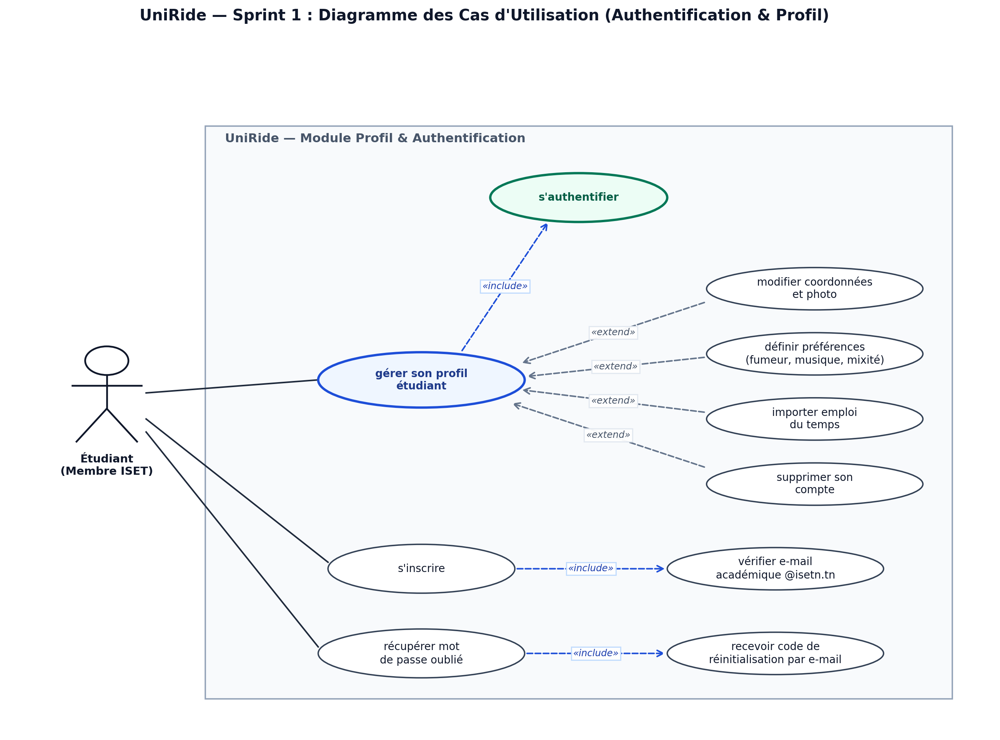

📥 **Téléchargements :** [Format Image PNG](./docs/diagrammes/sprint1_usecase.png) | [Format Vectoriel SVG](./docs/diagrammes/sprint1_usecase.svg)

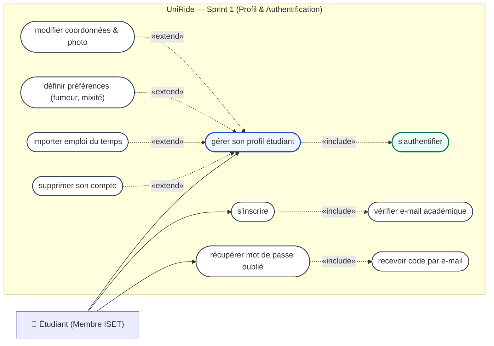
```mermaid
flowchart LR
    Etu["👤 Étudiant (Membre ISET)"]
    
    subgraph S1["UniRide — Sprint 1 (Profil & Authentification)"]
        Auth(["s'authentifier"]):::authUC
        
        CP_Profil(["gérer son profil étudiant"]):::mainUC
        
        Sub_Coords(["modifier coordonnées & photo"]):::subUC
        Sub_Prefs(["définir préférences (fumeur, mixité)"]):::subUC
        Sub_EDT(["importer emploi du temps"]):::subUC
        Sub_Del(["supprimer son compte"]):::subUC
        
        UC_Inscr(["s'inscrire"]):::subUC
        UC_Mail(["vérifier e-mail académique"]):::subUC
        
        UC_Forgot(["récupérer mot de passe oublié"]):::subUC
        UC_Code(["recevoir code par e-mail"]):::subUC
    end
    
    Etu --> CP_Profil
    CP_Profil -.->|"«include»"| Auth
    
    Sub_Coords -.->|"«extend»"| CP_Profil
    Sub_Prefs -.->|"«extend»"| CP_Profil
    Sub_EDT -.->|"«extend»"| CP_Profil
    Sub_Del -.->|"«extend»"| CP_Profil
    
    Etu --> UC_Inscr
    UC_Inscr -.->|"«include»"| UC_Mail
    
    Etu --> UC_Forgot
    UC_Forgot -.->|"«include»"| UC_Code

    classDef mainUC fill:#eff6ff,stroke:#1d4ed8,stroke-width:2px;
    classDef authUC fill:#ecfdf5,stroke:#047857,stroke-width:2px;
    classDef subUC fill:#ffffff,stroke:#334155,stroke-width:1.5px;
```

### Diagramme de Classes — Sprint 1

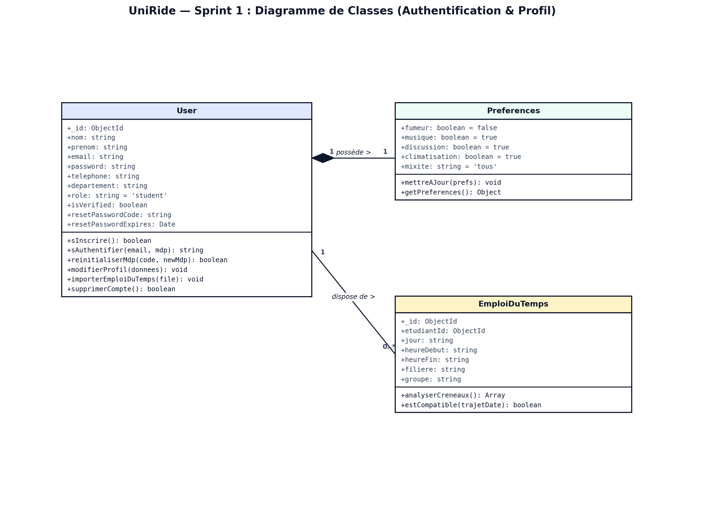

📥 **Téléchargements :** [Format Image PNG](./docs/diagrammes/sprint1_classes.png) | [Format Vectoriel SVG](./docs/diagrammes/sprint1_classes.svg)

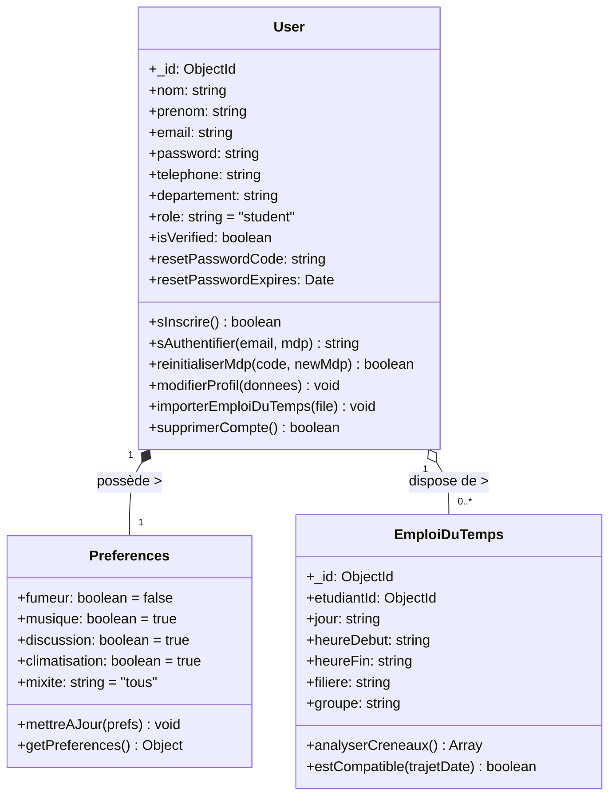
```mermaid
classDiagram
    class User {
        +_id: ObjectId
        +nom: string
        +prenom: string
        +email: string
        +password: string
        +telephone: string
        +departement: string
        +role: string = "student"
        +isVerified: boolean
        +resetPasswordCode: string
        +resetPasswordExpires: Date
        +sInscrire() boolean
        +sAuthentifier(email, mdp) string
        +reinitialiserMdp(code, newMdp) boolean
        +modifierProfil(donnees) void
        +importerEmploiDuTemps(file) void
        +supprimerCompte() boolean
    }

    class Preferences {
        +fumeur: boolean = false
        +musique: boolean = true
        +discussion: boolean = true
        +climatisation: boolean = true
        +mixite: string = "tous"
        +mettreAJour(prefs) void
        +getPreferences() Object
    }

    class EmploiDuTemps {
        +_id: ObjectId
        +etudiantId: ObjectId
        +jour: string
        +heureDebut: string
        +heureFin: string
        +filiere: string
        +groupe: string
        +analyserCreneaux() Array
        +estCompatible(trajetDate) boolean
    }

    User "1" *-- "1" Preferences : possède >
    User "1" o-- "0..*" EmploiDuTemps : dispose de >
```

---

## Sprint 2 : Publication & Gestion des Trajets Conducteur

### Objectifs
- Enregistrer et gérer un véhicule (marque, modèle, immatriculation, places).
- Publier un trajet régulier ou ponctuel avec étapes et participation symbolique aux frais.
- Modifier, consulter ou annuler ses trajets en cours.

### Diagramme des Cas d'Utilisation — Sprint 2

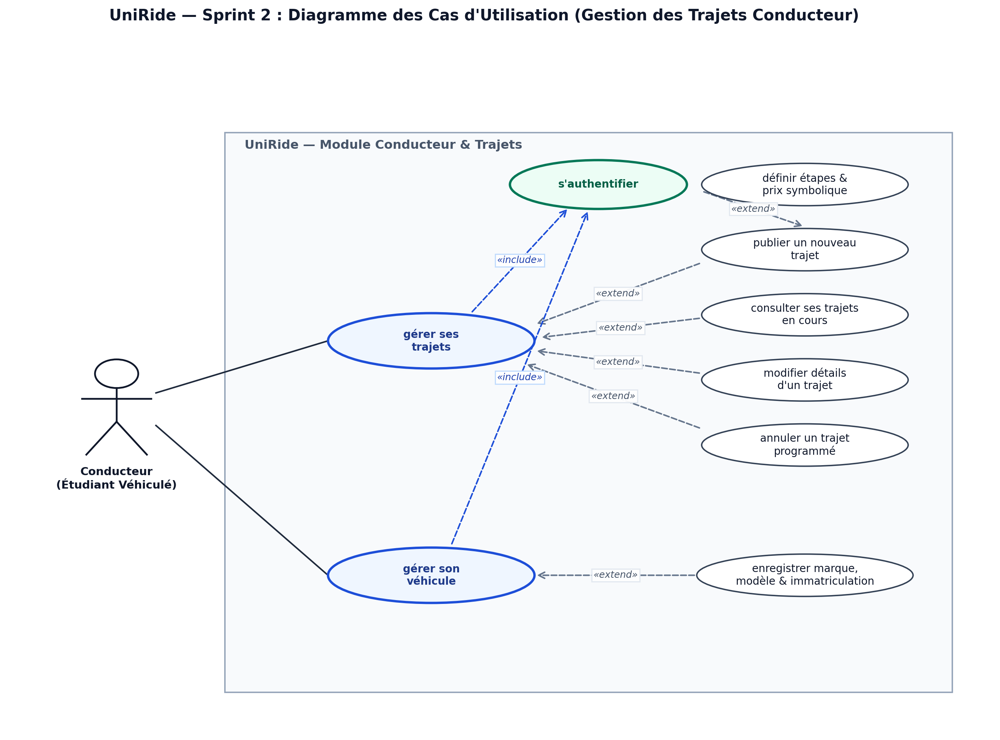

📥 **Téléchargements :** [Format Image PNG](./docs/diagrammes/sprint2_usecase.png) | [Format Vectoriel SVG](./docs/diagrammes/sprint2_usecase.svg)

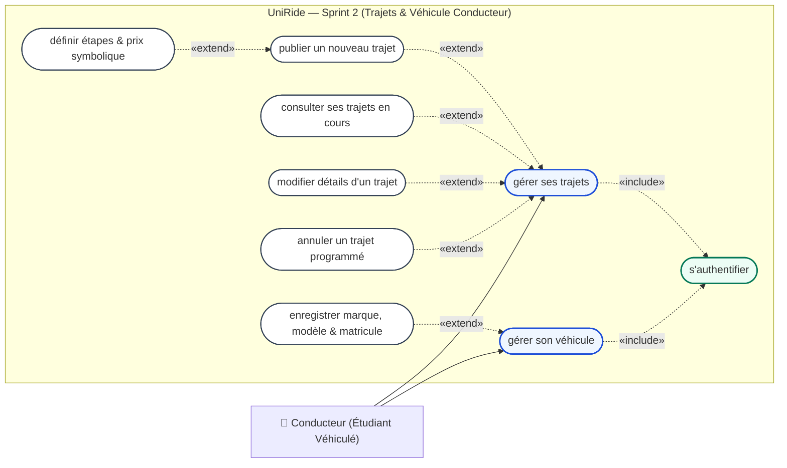
```mermaid
flowchart LR
    Cond["👤 Conducteur (Étudiant Véhiculé)"]
    
    subgraph S2["UniRide — Sprint 2 (Trajets & Véhicule Conducteur)"]
        Auth(["s'authentifier"]):::authUC
        
        CP_Trajets(["gérer ses trajets"]):::mainUC
        CP_Vehicule(["gérer son véhicule"]):::mainUC
        
        Sub_Publier(["publier un nouveau trajet"]):::subUC
        Sub_Etapes(["définir étapes & prix symbolique"]):::subUC
        Sub_Liste(["consulter ses trajets en cours"]):::subUC
        Sub_Modif(["modifier détails d'un trajet"]):::subUC
        Sub_Annul(["annuler un trajet programmé"]):::subUC
        
        Sub_VehReg(["enregistrer marque, modèle & matricule"]):::subUC
    end
    
    Cond --> CP_Trajets
    CP_Trajets -.->|"«include»"| Auth
    
    Sub_Publier -.->|"«extend»"| CP_Trajets
    Sub_Etapes -.->|"«extend»"| Sub_Publier
    Sub_Liste -.->|"«extend»"| CP_Trajets
    Sub_Modif -.->|"«extend»"| CP_Trajets
    Sub_Annul -.->|"«extend»"| CP_Trajets
    
    Cond --> CP_Vehicule
    CP_Vehicule -.->|"«include»"| Auth
    Sub_VehReg -.->|"«extend»"| CP_Vehicule

    classDef mainUC fill:#eff6ff,stroke:#1d4ed8,stroke-width:2px;
    classDef authUC fill:#ecfdf5,stroke:#047857,stroke-width:2px;
    classDef subUC fill:#ffffff,stroke:#334155,stroke-width:1.5px;
```

### Diagramme de Classes — Sprint 2

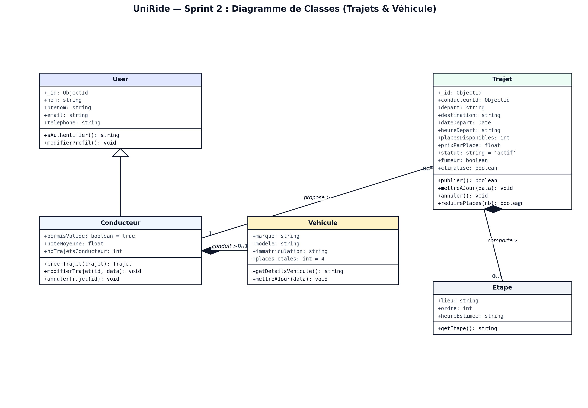

📥 **Téléchargements :** [Format Image PNG](./docs/diagrammes/sprint2_classes.png) | [Format Vectoriel SVG](./docs/diagrammes/sprint2_classes.svg)

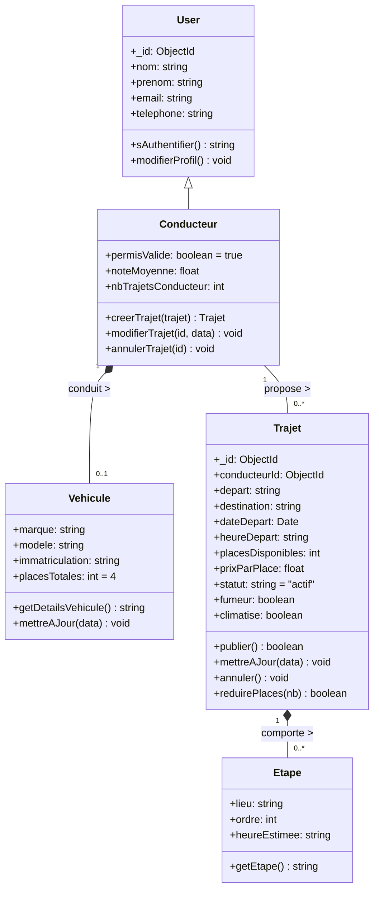
```mermaid
classDiagram
    class User {
        +_id: ObjectId
        +nom: string
        +prenom: string
        +email: string
        +telephone: string
        +sAuthentifier() string
        +modifierProfil() void
    }

    class Conducteur {
        +permisValide: boolean = true
        +noteMoyenne: float
        +nbTrajetsConducteur: int
        +creerTrajet(trajet) Trajet
        +modifierTrajet(id, data) void
        +annulerTrajet(id) void
    }

    class Vehicule {
        +marque: string
        +modele: string
        +immatriculation: string
        +placesTotales: int = 4
        +getDetailsVehicule() string
        +mettreAJour(data) void
    }

    class Trajet {
        +_id: ObjectId
        +conducteurId: ObjectId
        +depart: string
        +destination: string
        +dateDepart: Date
        +heureDepart: string
        +placesDisponibles: int
        +prixParPlace: float
        +statut: string = "actif"
        +fumeur: boolean
        +climatise: boolean
        +publier() boolean
        +mettreAJour(data) void
        +annuler() void
        +reduirePlaces(nb) boolean
    }

    class Etape {
        +lieu: string
        +ordre: int
        +heureEstimee: string
        +getEtape() string
    }

    User <|-- Conducteur
    Conducteur "1" *-- "0..1" Vehicule : conduit >
    Conducteur "1" -- "0..*" Trajet : propose >
    Trajet "1" *-- "0..*" Etape : comporte >
```

---

## Sprint 3 : Recherche Intelligente & Réservation Passager

### Objectifs
- Rechercher des trajets avec filtres (date, créneau, compatibilité EDT).
- Réserver des places et suivre le statut de la demande.
- Valider ou refuser les demandes côté conducteur.

### Diagramme des Cas d'Utilisation — Sprint 3

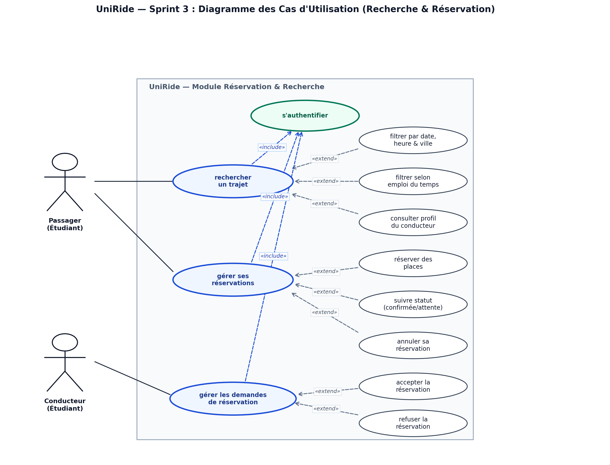

📥 **Téléchargements :** [Format Image PNG](./docs/diagrammes/sprint3_usecase.png) | [Format Vectoriel SVG](./docs/diagrammes/sprint3_usecase.svg)

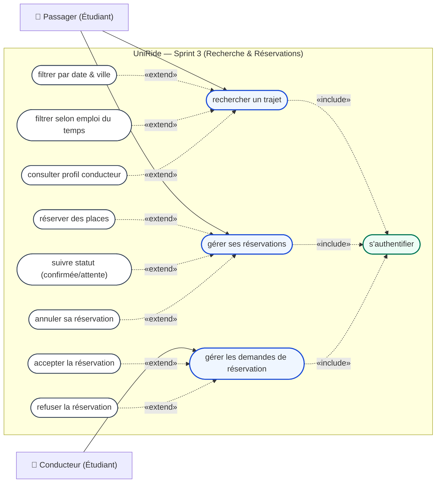
```mermaid
flowchart LR
    Pass["👤 Passager (Étudiant)"]
    Cond["👤 Conducteur (Étudiant)"]
    
    subgraph S3["UniRide — Sprint 3 (Recherche & Réservations)"]
        Auth(["s'authentifier"]):::authUC
        
        CP_Rech(["rechercher un trajet"]):::mainUC
        CP_ResPass(["gérer ses réservations"]):::mainUC
        CP_DemCond(["gérer les demandes de réservation"]):::mainUC
        
        Sub_FiltreGeo(["filtrer par date & ville"]):::subUC
        Sub_FiltreEDT(["filtrer selon emploi du temps"]):::subUC
        Sub_ProfilCond(["consulter profil conducteur"]):::subUC
        
        Sub_FaireRes(["réserver des places"]):::subUC
        Sub_SuivreRes(["suivre statut (confirmée/attente)"]):::subUC
        Sub_AnnulRes(["annuler sa réservation"]):::subUC
        
        Sub_Accepter(["accepter la réservation"]):::subUC
        Sub_Refuser(["refuser la réservation"]):::subUC
    end
    
    Pass --> CP_Rech
    CP_Rech -.->|"«include»"| Auth
    Sub_FiltreGeo -.->|"«extend»"| CP_Rech
    Sub_FiltreEDT -.->|"«extend»"| CP_Rech
    Sub_ProfilCond -.->|"«extend»"| CP_Rech
    
    Pass --> CP_ResPass
    CP_ResPass -.->|"«include»"| Auth
    Sub_FaireRes -.->|"«extend»"| CP_ResPass
    Sub_SuivreRes -.->|"«extend»"| CP_ResPass
    Sub_AnnulRes -.->|"«extend»"| CP_ResPass
    
    Cond --> CP_DemCond
    CP_DemCond -.->|"«include»"| Auth
    Sub_Accepter -.->|"«extend»"| CP_DemCond
    Sub_Refuser -.->|"«extend»"| CP_DemCond

    classDef mainUC fill:#eff6ff,stroke:#1d4ed8,stroke-width:2px;
    classDef authUC fill:#ecfdf5,stroke:#047857,stroke-width:2px;
    classDef subUC fill:#ffffff,stroke:#334155,stroke-width:1.5px;
```

### Diagramme de Classes — Sprint 3

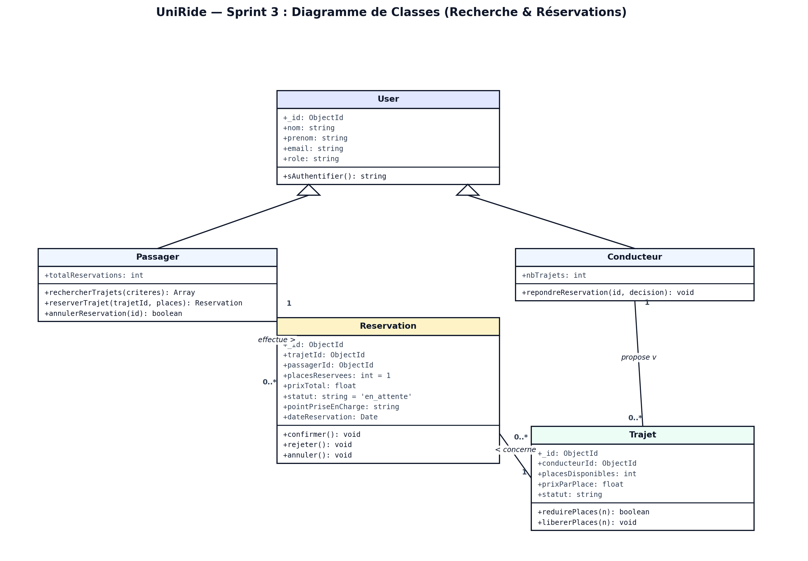

📥 **Téléchargements :** [Format Image PNG](./docs/diagrammes/sprint3_classes.png) | [Format Vectoriel SVG](./docs/diagrammes/sprint3_classes.svg)

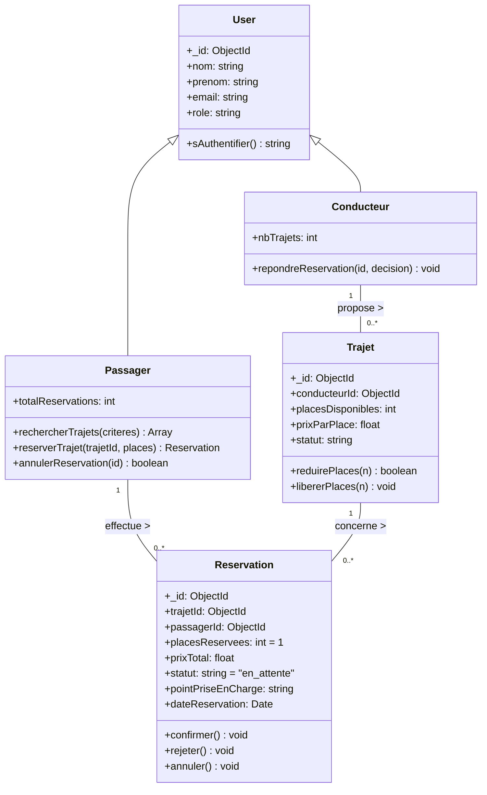
```mermaid
classDiagram
    class User {
        +_id: ObjectId
        +nom: string
        +prenom: string
        +email: string
        +role: string
        +sAuthentifier() string
    }

    class Passager {
        +totalReservations: int
        +rechercherTrajets(criteres) Array
        +reserverTrajet(trajetId, places) Reservation
        +annulerReservation(id) boolean
    }

    class Conducteur {
        +nbTrajets: int
        +repondreReservation(id, decision) void
    }

    class Reservation {
        +_id: ObjectId
        +trajetId: ObjectId
        +passagerId: ObjectId
        +placesReservees: int = 1
        +prixTotal: float
        +statut: string = "en_attente"
        +pointPriseEnCharge: string
        +dateReservation: Date
        +confirmer() void
        +rejeter() void
        +annuler() void
    }

    class Trajet {
        +_id: ObjectId
        +conducteurId: ObjectId
        +placesDisponibles: int
        +prixParPlace: float
        +statut: string
        +reduirePlaces(n) boolean
        +libererPlaces(n) void
    }

    User <|-- Passager
    User <|-- Conducteur
    Passager "1" -- "0..*" Reservation : effectue >
    Trajet "1" -- "0..*" Reservation : concerne >
    Conducteur "1" -- "0..*" Trajet : propose >
```

---

## Sprint 4 : Sécurité, Traçabilité & Mode Urgence (SOS)

### Objectifs
- Suivre le trajet en direct (validation départ, arrivée).
- Déclencher l'alerte SOS d'urgence avec transmission des coordonnées GPS en temps réel.
- Appeler les secours (197 / Protection Civile) ou prévenir la sécurité du campus ISET.

### Diagramme des Cas d'Utilisation — Sprint 4

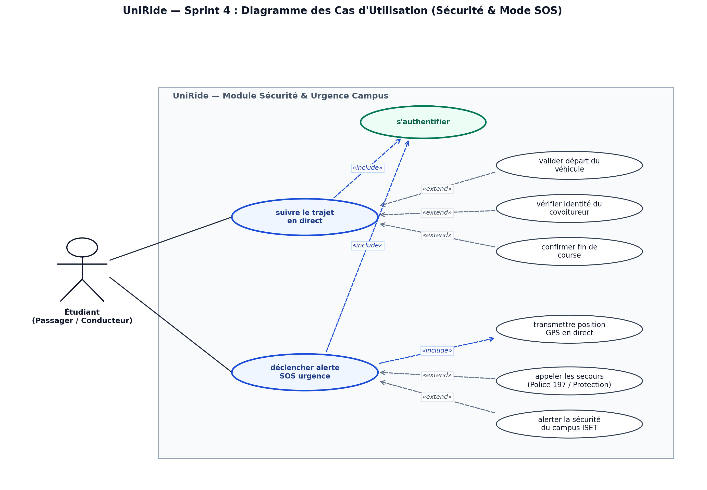

📥 **Téléchargements :** [Format Image PNG](./docs/diagrammes/sprint4_usecase.png) | [Format Vectoriel SVG](./docs/diagrammes/sprint4_usecase.svg)

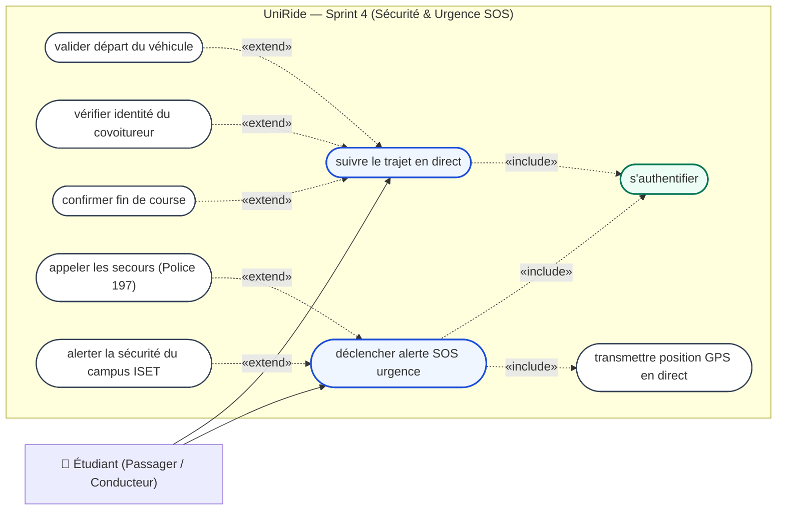
```mermaid
flowchart LR
    Etu["👤 Étudiant (Passager / Conducteur)"]
    
    subgraph S4["UniRide — Sprint 4 (Sécurité & Urgence SOS)"]
        Auth(["s'authentifier"]):::authUC
        
        CP_Suivi(["suivre le trajet en direct"]):::mainUC
        CP_SOS(["déclencher alerte SOS urgence"]):::mainUC
        
        Sub_Depart(["valider départ du véhicule"]):::subUC
        Sub_Verif(["vérifier identité du covoitureur"]):::subUC
        Sub_Fin(["confirmer fin de course"]):::subUC
        
        Inc_GPS(["transmettre position GPS en direct"]):::subUC
        Sub_Secours(["appeler les secours (Police 197)"]):::subUC
        Sub_Campus(["alerter la sécurité du campus ISET"]):::subUC
    end
    
    Etu --> CP_Suivi
    CP_Suivi -.->|"«include»"| Auth
    Sub_Depart -.->|"«extend»"| CP_Suivi
    Sub_Verif -.->|"«extend»"| CP_Suivi
    Sub_Fin -.->|"«extend»"| CP_Suivi
    
    Etu --> CP_SOS
    CP_SOS -.->|"«include»"| Auth
    CP_SOS -.->|"«include»"| Inc_GPS
    Sub_Secours -.->|"«extend»"| CP_SOS
    Sub_Campus -.->|"«extend»"| CP_SOS

    classDef mainUC fill:#eff6ff,stroke:#1d4ed8,stroke-width:2px;
    classDef authUC fill:#ecfdf5,stroke:#047857,stroke-width:2px;
    classDef subUC fill:#ffffff,stroke:#334155,stroke-width:1.5px;
```

### Diagramme de Classes — Sprint 4

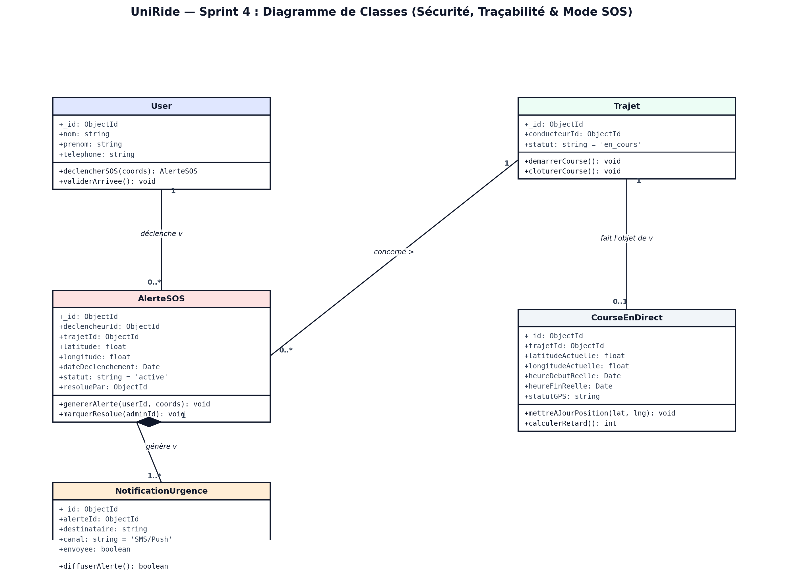

📥 **Téléchargements :** [Format Image PNG](./docs/diagrammes/sprint4_classes.png) | [Format Vectoriel SVG](./docs/diagrammes/sprint4_classes.svg)

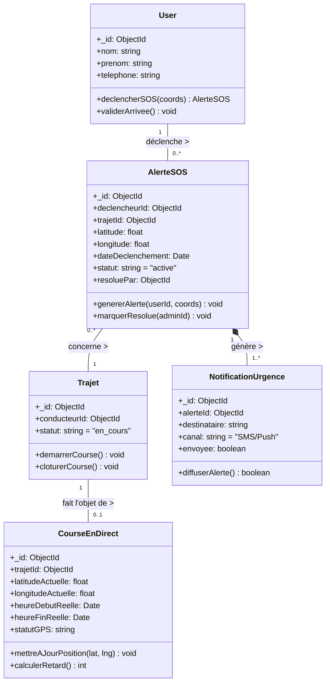
```mermaid
classDiagram
    class User {
        +_id: ObjectId
        +nom: string
        +prenom: string
        +telephone: string
        +declencherSOS(coords) AlerteSOS
        +validerArrivee() void
    }

    class Trajet {
        +_id: ObjectId
        +conducteurId: ObjectId
        +statut: string = "en_cours"
        +demarrerCourse() void
        +cloturerCourse() void
    }

    class CourseEnDirect {
        +_id: ObjectId
        +trajetId: ObjectId
        +latitudeActuelle: float
        +longitudeActuelle: float
        +heureDebutReelle: Date
        +heureFinReelle: Date
        +statutGPS: string
        +mettreAJourPosition(lat, lng) void
        +calculerRetard() int
    }

    class AlerteSOS {
        +_id: ObjectId
        +declencheurId: ObjectId
        +trajetId: ObjectId
        +latitude: float
        +longitude: float
        +dateDeclenchement: Date
        +statut: string = "active"
        +resoluePar: ObjectId
        +genererAlerte(userId, coords) void
        +marquerResolue(adminId) void
    }

    class NotificationUrgence {
        +_id: ObjectId
        +alerteId: ObjectId
        +destinataire: string
        +canal: string = "SMS/Push"
        +envoyee: boolean
        +diffuserAlerte() boolean
    }

    User "1" -- "0..*" AlerteSOS : déclenche >
    Trajet "1" -- "0..1" CourseEnDirect : fait l'objet de >
    AlerteSOS "1" *-- "1..*" NotificationUrgence : génère >
    AlerteSOS "0..*" -- "1" Trajet : concerne >
```

---

## Sprint 5 : Communication, Évaluations & Gamification Éco-responsable

### Objectifs
- Évaluer ses covoitureurs (note sur 5 étoiles, commentaire textuel, signalement si litige).
- Suivre les statistiques d'éco-mobilité (CO2 évité, DT économisés).
- Débloquer des badges médaillés et consulter le classement campus.

### Diagramme des Cas d'Utilisation — Sprint 5

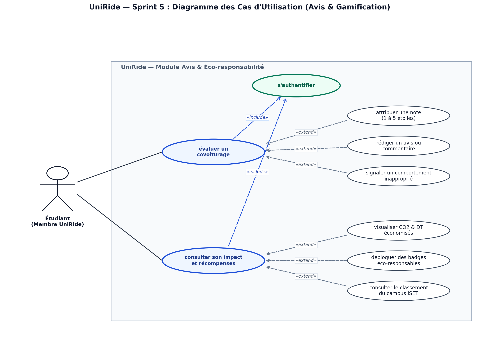

📥 **Téléchargements :** [Format Image PNG](./docs/diagrammes/sprint5_usecase.png) | [Format Vectoriel SVG](./docs/diagrammes/sprint5_usecase.svg)

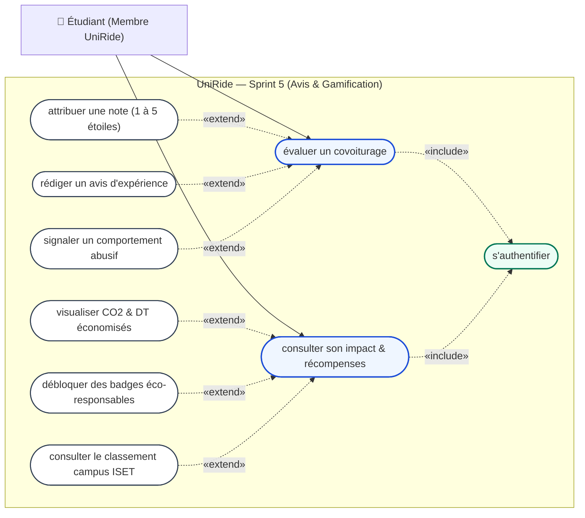
```mermaid
flowchart LR
    Etu["👤 Étudiant (Membre UniRide)"]
    
    subgraph S5["UniRide — Sprint 5 (Avis & Gamification)"]
        Auth(["s'authentifier"]):::authUC
        
        CP_Avis(["évaluer un covoiturage"]):::mainUC
        CP_Eco(["consulter son impact & récompenses"]):::mainUC
        
        Sub_Note(["attribuer une note (1 à 5 étoiles)"]):::subUC
        Sub_Comm(["rédiger un avis d'expérience"]):::subUC
        Sub_Signaler(["signaler un comportement abusif"]):::subUC
        
        Sub_Stats(["visualiser CO2 & DT économisés"]):::subUC
        Sub_Badges(["débloquer des badges éco-responsables"]):::subUC
        Sub_Classement(["consulter le classement campus ISET"]):::subUC
    end
    
    Etu --> CP_Avis
    CP_Avis -.->|"«include»"| Auth
    Sub_Note -.->|"«extend»"| CP_Avis
    Sub_Comm -.->|"«extend»"| CP_Avis
    Sub_Signaler -.->|"«extend»"| CP_Avis
    
    Etu --> CP_Eco
    CP_Eco -.->|"«include»"| Auth
    Sub_Stats -.->|"«extend»"| CP_Eco
    Sub_Badges -.->|"«extend»"| CP_Eco
    Sub_Classement -.->|"«extend»"| CP_Eco

    classDef mainUC fill:#eff6ff,stroke:#1d4ed8,stroke-width:2px;
    classDef authUC fill:#ecfdf5,stroke:#047857,stroke-width:2px;
    classDef subUC fill:#ffffff,stroke:#334155,stroke-width:1.5px;
```

### Diagramme de Classes — Sprint 5

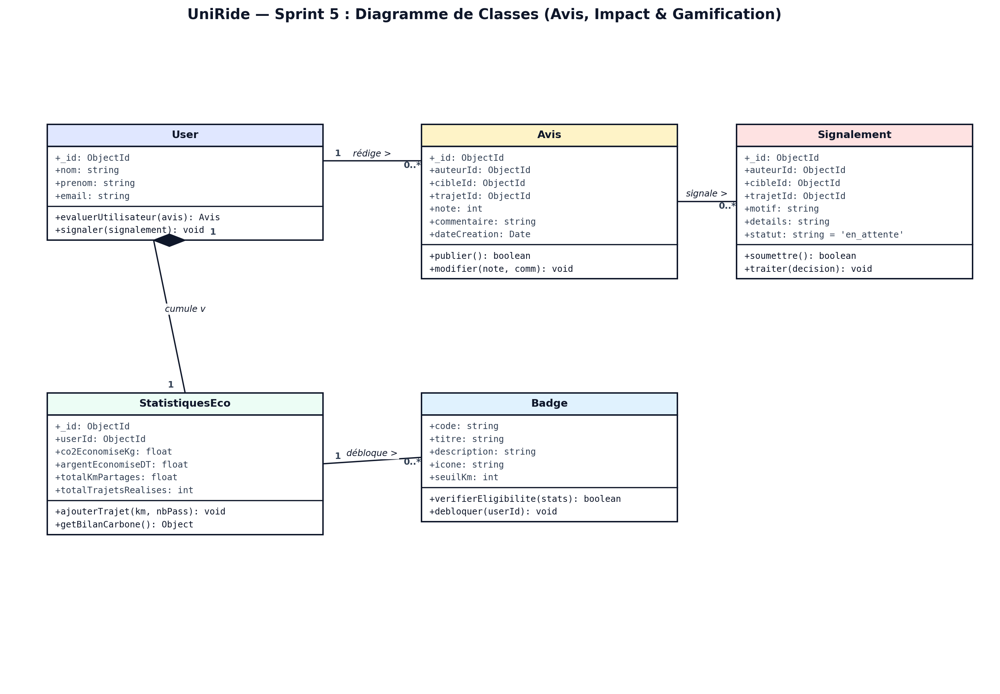

📥 **Téléchargements :** [Format Image PNG](./docs/diagrammes/sprint5_classes.png) | [Format Vectoriel SVG](./docs/diagrammes/sprint5_classes.svg)

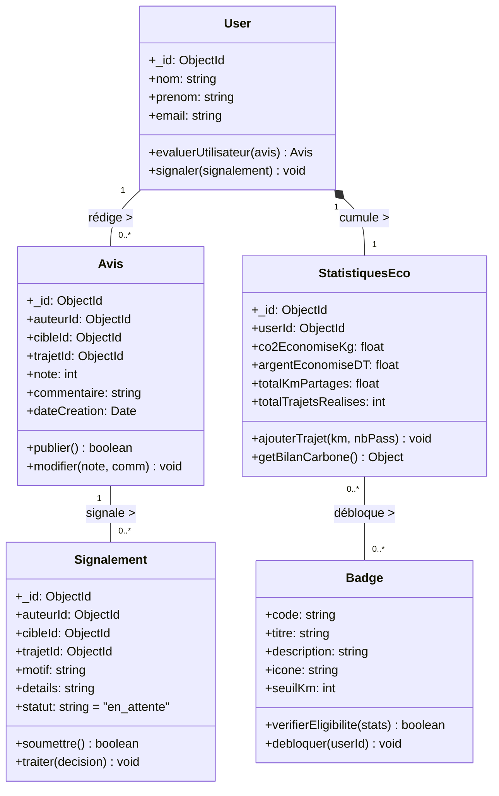
```mermaid
classDiagram
    class User {
        +_id: ObjectId
        +nom: string
        +prenom: string
        +email: string
        +evaluerUtilisateur(avis) Avis
        +signaler(signalement) void
    }

    class Avis {
        +_id: ObjectId
        +auteurId: ObjectId
        +cibleId: ObjectId
        +trajetId: ObjectId
        +note: int
        +commentaire: string
        +dateCreation: Date
        +publier() boolean
        +modifier(note, comm) void
    }

    class StatistiquesEco {
        +_id: ObjectId
        +userId: ObjectId
        +co2EconomiseKg: float
        +argentEconomiseDT: float
        +totalKmPartages: float
        +totalTrajetsRealises: int
        +ajouterTrajet(km, nbPass) void
        +getBilanCarbone() Object
    }

    class Badge {
        +code: string
        +titre: string
        +description: string
        +icone: string
        +seuilKm: int
        +verifierEligibilite(stats) boolean
        +debloquer(userId) void
    }

    class Signalement {
        +_id: ObjectId
        +auteurId: ObjectId
        +cibleId: ObjectId
        +trajetId: ObjectId
        +motif: string
        +details: string
        +statut: string = "en_attente"
        +soumettre() boolean
        +traiter(decision) void
    }

    User "1" -- "0..*" Avis : rédige >
    User "1" *-- "1" StatistiquesEco : cumule >
    StatistiquesEco "0..*" -- "0..*" Badge : débloque >
    Avis "1" -- "0..*" Signalement : signale >
```

---

## Sprint 6 : Administration & Modération Campus

### Objectifs
- Superviser la plateforme (dashboard en temps réel, alertes SOS actives).
- Gérer les utilisateurs (liste étudiants, rôles, blocage/déblocage de comptes).
- Traiter ou classer les signalements.

### Diagramme des Cas d'Utilisation — Sprint 6

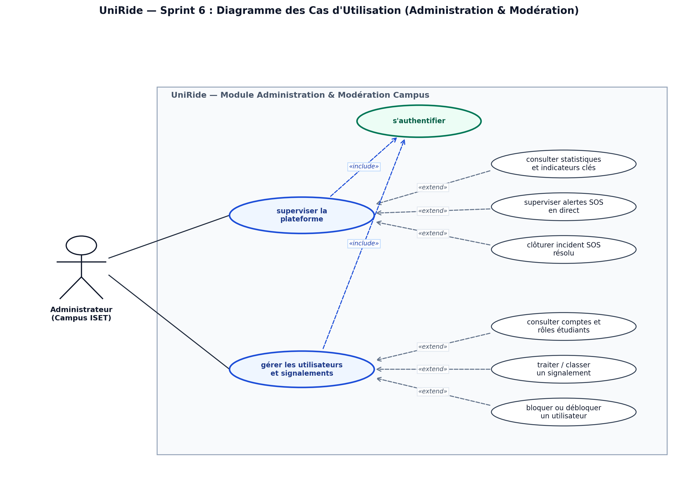

📥 **Téléchargements :** [Format Image PNG](./docs/diagrammes/sprint6_usecase.png) | [Format Vectoriel SVG](./docs/diagrammes/sprint6_usecase.svg)

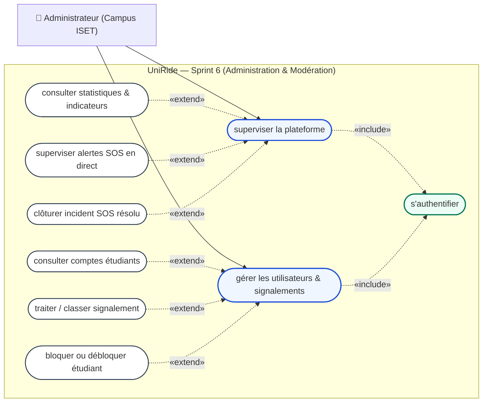
```mermaid
flowchart LR
    Admin["👤 Administrateur (Campus ISET)"]
    
    subgraph S6["UniRide — Sprint 6 (Administration & Modération)"]
        Auth(["s'authentifier"]):::authUC
        
        CP_Superv(["superviser la plateforme"]):::mainUC
        CP_GestUser(["gérer les utilisateurs & signalements"]):::mainUC
        
        Sub_Stats(["consulter statistiques & indicateurs"]):::subUC
        Sub_LiveSOS(["superviser alertes SOS en direct"]):::subUC
        Sub_CloseSOS(["clôturer incident SOS résolu"]):::subUC
        
        Sub_ListUsers(["consulter comptes étudiants"]):::subUC
        Sub_TraitSig(["traiter / classer signalement"]):::subUC
        Sub_Block(["bloquer ou débloquer étudiant"]):::subUC
    end
    
    Admin --> CP_Superv
    CP_Superv -.->|"«include»"| Auth
    Sub_Stats -.->|"«extend»"| CP_Superv
    Sub_LiveSOS -.->|"«extend»"| CP_Superv
    Sub_CloseSOS -.->|"«extend»"| CP_Superv
    
    Admin --> CP_GestUser
    CP_GestUser -.->|"«include»"| Auth
    Sub_ListUsers -.->|"«extend»"| CP_GestUser
    Sub_TraitSig -.->|"«extend»"| CP_GestUser
    Sub_Block -.->|"«extend»"| CP_GestUser

    classDef mainUC fill:#eff6ff,stroke:#1d4ed8,stroke-width:2px;
    classDef authUC fill:#ecfdf5,stroke:#047857,stroke-width:2px;
    classDef subUC fill:#ffffff,stroke:#334155,stroke-width:1.5px;
```

### Diagramme de Classes — Sprint 6

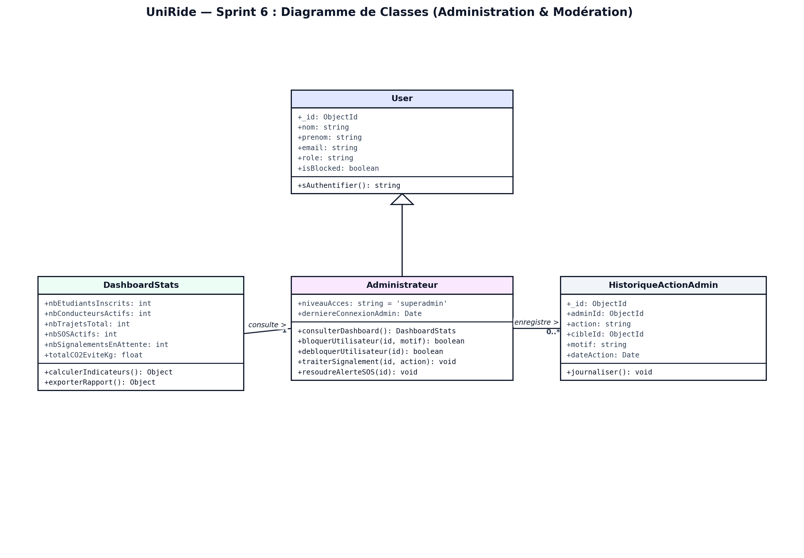

📥 **Téléchargements :** [Format Image PNG](./docs/diagrammes/sprint6_classes.png) | [Format Vectoriel SVG](./docs/diagrammes/sprint6_classes.svg)

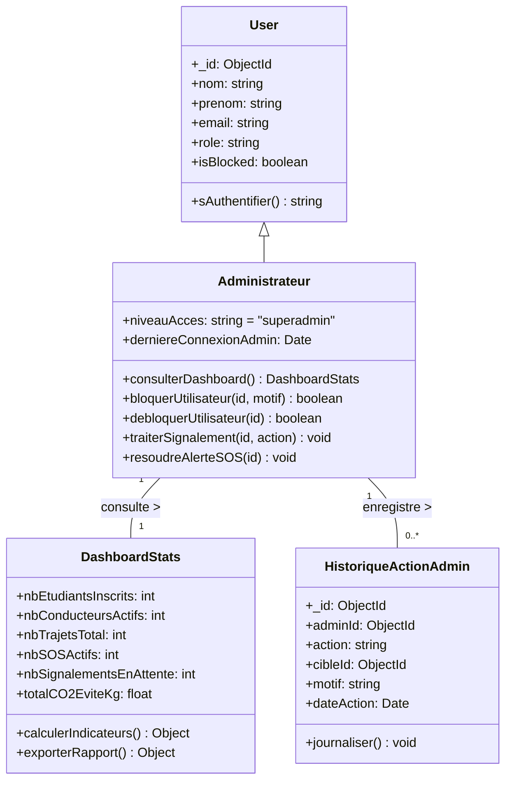
```mermaid
classDiagram
    class User {
        +_id: ObjectId
        +nom: string
        +prenom: string
        +email: string
        +role: string
        +isBlocked: boolean
        +sAuthentifier() string
    }

    class Administrateur {
        +niveauAcces: string = "superadmin"
        +derniereConnexionAdmin: Date
        +consulterDashboard() DashboardStats
        +bloquerUtilisateur(id, motif) boolean
        +debloquerUtilisateur(id) boolean
        +traiterSignalement(id, action) void
        +resoudreAlerteSOS(id) void
    }

    class DashboardStats {
        +nbEtudiantsInscrits: int
        +nbConducteursActifs: int
        +nbTrajetsTotal: int
        +nbSOSActifs: int
        +nbSignalementsEnAttente: int
        +totalCO2EviteKg: float
        +calculerIndicateurs() Object
        +exporterRapport() Object
    }

    class HistoriqueActionAdmin {
        +_id: ObjectId
        +adminId: ObjectId
        +action: string
        +cibleId: ObjectId
        +motif: string
        +dateAction: Date
        +journaliser() void
    }

    User <|-- Administrateur
    Administrateur "1" -- "1" DashboardStats : consulte >
    Administrateur "1" -- "0..*" HistoriqueActionAdmin : enregistre >
```

---

## 8. Vue Globale du Système

### Diagramme Global des Cas d'Utilisation

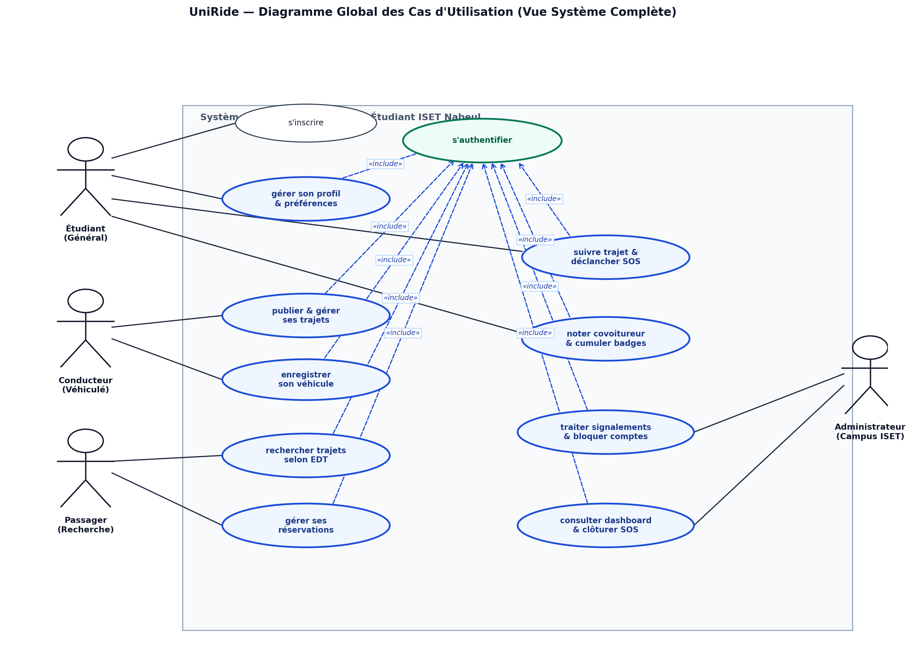

📥 **Téléchargements :** [Format Image PNG](./docs/diagrammes/global_usecase.png) | [Format Vectoriel SVG](./docs/diagrammes/global_usecase.svg)

```mermaid
flowchart TD
    EtuGen["👤 Étudiant (Général)"]
    Cond["👤 Conducteur"]
    Pass["👤 Passager"]
    Admin["👤 Administrateur Campus"]

    EtuGen <|-- Cond
    EtuGen <|-- Pass

    subgraph GlobalUniRide["Plateforme Globale UniRide (ISET Nabeul)"]
        Auth(["s'authentifier"]):::authUC
        
        UC_Inscr(["s'inscrire / valider email"]):::subUC
        UC_Profil(["gérer son profil & préférences"]):::mainUC
        UC_Traj(["publier & gérer trajets"]):::mainUC
        UC_Veh(["enregistrer véhicule"]):::mainUC
        UC_Rech(["rechercher trajets selon EDT"]):::mainUC
        UC_Res(["gérer réservations"]):::mainUC
        UC_SOS(["suivre trajet & alerte SOS"]):::mainUC
        UC_Eco(["évaluer covoitureur & badges"]):::mainUC
        UC_AdminMod(["modérer signalements & comptes"]):::mainUC
        UC_AdminDash(["superviser dashboard & SOS"]):::mainUC
    end

    EtuGen --> UC_Inscr
    EtuGen --> UC_Profil
    UC_Profil -.->|"«include»"| Auth

    Cond --> UC_Traj
    UC_Traj -.->|"«include»"| Auth
    Cond --> UC_Veh
    UC_Veh -.->|"«include»"| Auth

    Pass --> UC_Rech
    UC_Rech -.->|"«include»"| Auth
    Pass --> UC_Res
    UC_Res -.->|"«include»"| Auth

    EtuGen --> UC_SOS
    UC_SOS -.->|"«include»"| Auth
    EtuGen --> UC_Eco
    UC_Eco -.->|"«include»"| Auth

    Admin --> UC_AdminMod
    UC_AdminMod -.->|"«include»"| Auth
    Admin --> UC_AdminDash
    UC_AdminDash -.->|"«include»"| Auth

    classDef mainUC fill:#eff6ff,stroke:#1d4ed8,stroke-width:2px;
    classDef authUC fill:#ecfdf5,stroke:#047857,stroke-width:2px;
    classDef subUC fill:#ffffff,stroke:#334155,stroke-width:1.5px;
```

---

### Diagramme Global des Classes du Système

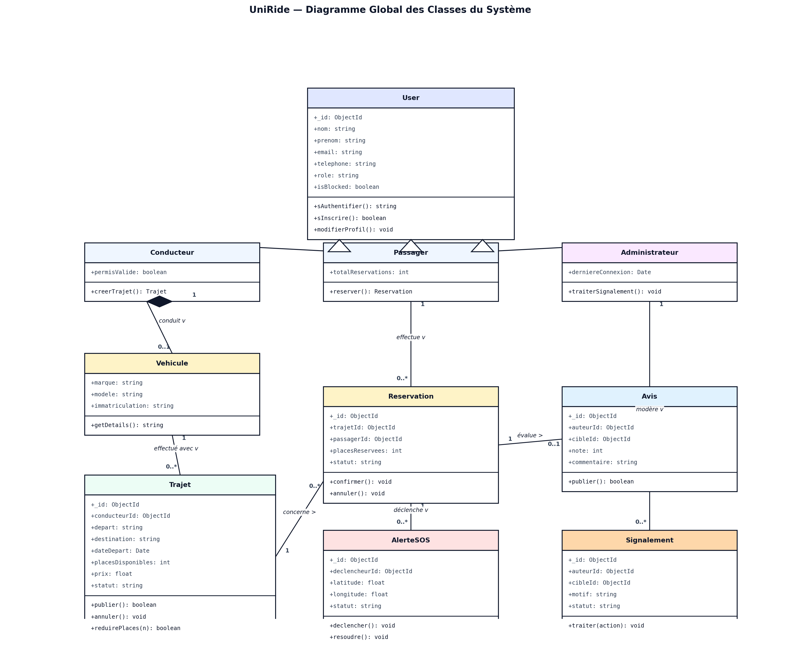

📥 **Téléchargements :** [Format Image PNG](./docs/diagrammes/global_classes.png) | [Format Vectoriel SVG](./docs/diagrammes/global_classes.svg)

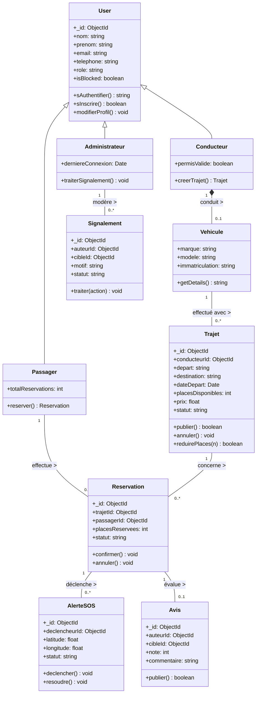
```mermaid
classDiagram
    class User {
        +_id: ObjectId
        +nom: string
        +prenom: string
        +email: string
        +telephone: string
        +role: string
        +isBlocked: boolean
        +sAuthentifier() string
        +sInscrire() boolean
        +modifierProfil() void
    }

    class Conducteur {
        +permisValide: boolean
        +creerTrajet() Trajet
    }

    class Passager {
        +totalReservations: int
        +reserver() Reservation
    }

    class Administrateur {
        +derniereConnexion: Date
        +traiterSignalement() void
    }

    class Vehicule {
        +marque: string
        +modele: string
        +immatriculation: string
        +getDetails() string
    }

    class Trajet {
        +_id: ObjectId
        +conducteurId: ObjectId
        +depart: string
        +destination: string
        +dateDepart: Date
        +placesDisponibles: int
        +prix: float
        +statut: string
        +publier() boolean
        +annuler() void
        +reduirePlaces(n) boolean
    }

    class Reservation {
        +_id: ObjectId
        +trajetId: ObjectId
        +passagerId: ObjectId
        +placesReservees: int
        +statut: string
        +confirmer() void
        +annuler() void
    }

    class AlerteSOS {
        +_id: ObjectId
        +declencheurId: ObjectId
        +latitude: float
        +longitude: float
        +statut: string
        +declencher() void
        +resoudre() void
    }

    class Avis {
        +_id: ObjectId
        +auteurId: ObjectId
        +cibleId: ObjectId
        +note: int
        +commentaire: string
        +publier() boolean
    }

    class Signalement {
        +_id: ObjectId
        +auteurId: ObjectId
        +cibleId: ObjectId
        +motif: string
        +statut: string
        +traiter(action) void
    }

    User <|-- Conducteur
    User <|-- Passager
    User <|-- Administrateur

    Conducteur "1" *-- "0..1" Vehicule : conduit >
    Vehicule "1" -- "0..*" Trajet : effectué avec >
    Passager "1" -- "0..*" Reservation : effectue >
    Trajet "1" -- "0..*" Reservation : concerne >
    Reservation "1" -- "0..*" AlerteSOS : déclenche >
    Reservation "1" -- "0..1" Avis : évalue >
    Administrateur "1" -- "0..*" Signalement : modère >
```
